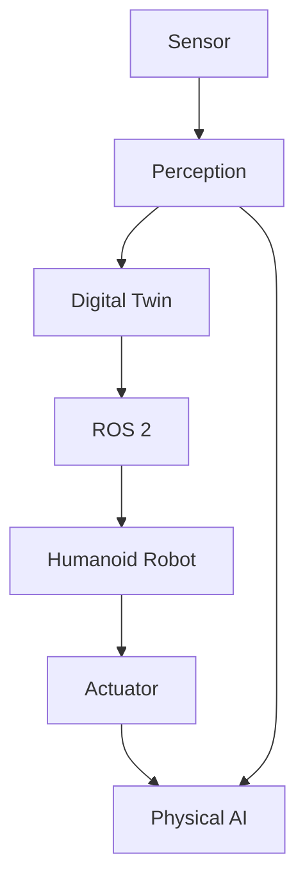

# Glossary

## A

**Actuator**: A device that converts energy into physical motion (e.g., motors, servos).

**Autonomous**: Operating independently without human intervention.

## C

**Computer Vision**: Field of AI that enables computers to interpret visual information.

## D

**Digital Twin**: A virtual representation of a physical system used for simulation and testing.

## E

**Embedding**: A numerical representation of data (text, images) in a vector space.

## H

**Humanoid Robot**: A robot designed to resemble and function like a human.

## I

**IMU (Inertial Measurement Unit)**: A sensor that measures acceleration and angular velocity.

**Isaac Sim**: NVIDIA's robotics simulation platform.

## L

**LiDAR**: Light Detection and Ranging - a sensor that measures distance using laser light.

## P

**Perception**: The process of interpreting sensor data to understand the environment.

**Physical AI**: AI systems that interact with the physical world through sensors and actuators.

## R

**ROS 2 (Robot Operating System 2)**: Open-source middleware for robotics development.

**RAG (Retrieval-Augmented Generation)**: AI technique that combines retrieval of information with text generation.

## S

**Sensor**: A device that detects and measures physical properties (e.g., cameras, temperature sensors).

**Sim-to-Real**: Transferring skills learned in simulation to real-world robots.

## V

**VLA (Vision-Language-Action)**: AI systems that combine vision, language understanding, and physical action.

## Diagrams

## References

- **General Robotics**: Siciliano, B., Khatib, O. (Eds.). (2016). *Springer Handbook of Robotics*. Springer.
- **ROS 2**: The official ROS 2 Documentation: [https://docs.ros.org/en/humble/](https://docs.ros.org/en/humble/)
- **Digital Twins**: Grieves, M., & Vickers, G. (2017). Digital Twin: Mitigating the Risks of Integrating Imperfect Models of Complex Systems in the Cloud. In *Transdisciplinary Perspectives on Complex Systems: New Findings and Approaches* (pp. 85-115). Springer.
- **NVIDIA Isaac Sim**: NVIDIA Isaac Sim Documentation: [https://docs.omniverse.nvidia.com/isaacsim/latest/index.html](https://docs.omniverse.nvidia.com/isaacsim/latest/index.html)
- **Humanoid Robotics**: Pratt, G. A., & Pratt, J. E. (2002). Intuitive control of a humanoid robot. In *Humanoid Robots, 2002. Proceedings. 2nd IEEE-RAS International Conference on* (pp. 267-272). IEEE.
- **Conversational AI**: Jurafsky, D., & Martin, J. H. (2009). *Speech and Language Processing: An Introduction to Natural Language Processing, Computational Linguistics, and Speech Recognition*. Prentice Hall.
