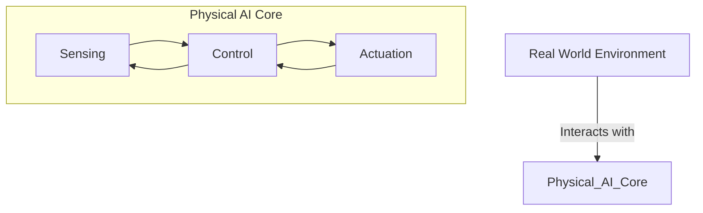

# Foundations of Physical AI (Weeks 1–2)

## Learning Objectives

By the end of this section, you will be able to:

- Understand the fundamental concepts of Physical AI
- Differentiate between traditional AI and Physical AI
- Identify key components of physical AI systems
- Set up a basic development environment

## Core Concepts

### What is Physical AI?

Physical AI combines artificial intelligence with physical systems, enabling robots and autonomous systems to interact with the real world. Unlike pure software AI, Physical AI must account for:

- **Sensing**: Perception of the environment
- **Actuation**: Physical movement and manipulation
- **Control**: Real-time decision making
- **Safety**: Physical constraints and safety measures

### Key Components

1. **Sensors**: Cameras, LiDAR, IMU, etc.
2. **Actuators**: Motors, servos, grippers
3. **Computing**: Edge devices, GPUs, embedded systems
4. **Software**: ROS 2, perception pipelines, control algorithms

## Lab Setup

See the [Lab Setup Guide](/docs/appendix/hardware) for detailed instructions on:

- Installing Ubuntu 22.04
- Setting up ROS 2 Humble/Iron
- Configuring Gazebo
- Installing Isaac Sim prerequisites

## Next Steps

- [Week 1: Introduction to Physical AI](/docs/foundations/week1)
- [Week 2: Sensor Systems and Perception](/docs/foundations/week2)

## Diagrams

