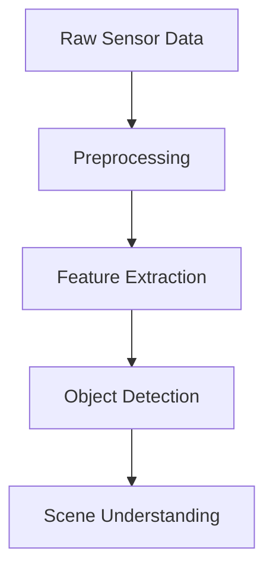

# Week 2: Sensor Systems and Perception

## Learning Objectives

By the end of this week, you will be able to:

- Understand different types of sensors used in Physical AI
- Process sensor data using ROS 2
- Implement basic perception pipelines
- Calibrate sensors for accurate measurements

## Core Concepts

### Sensor Types

1. **Vision Sensors**: Cameras (RGB, depth, stereo)
2. **Range Sensors**: LiDAR, ultrasonic sensors
3. **Inertial Sensors**: IMU, accelerometers, gyroscopes
4. **Tactile Sensors**: Force, pressure, touch sensors

### Perception Pipeline



## Hands-On Lab

### Lab 2.1: Camera Data Processing

**Objective**: Capture and process camera data using ROS 2.

**Steps**:

1. Install camera packages:
   ```bash
   sudo apt install ros-humble-cv-bridge ros-humble-image-transport
   ```
2. Create a workspace:
   ```bash
   mkdir -p ~/ros2_ws/src
   cd ~/ros2_ws/src
   ```
3. Create a simple image subscriber node
4. Run and visualize camera data

### Expected Output

You should see camera feed displayed in RViz or a similar visualization tool.

## Checkpoint Quiz

<details>
<summary>Question 1: What are the main components of a perception pipeline?</summary>

Preprocessing, feature extraction, object detection, and scene understanding.

</details>

## Safety & Ethics Notes

:::info Safety Reminder
When working with cameras and sensors:
- Be aware of privacy implications
- Follow data protection regulations
- Secure sensor data transmission
:::

## References & Further Reading

- ROS 2 Image Processing: [ROS 2 Image Tutorials](https://docs.ros.org/en/humble/Tutorials.html)
- Computer Vision Fundamentals: [OpenCV Documentation](https://docs.opencv.org/)

