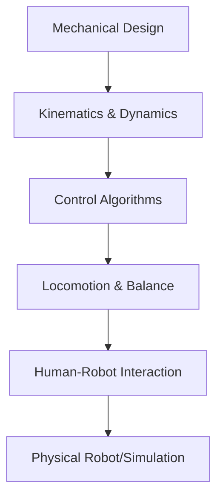

# Humanoid Development (Weeks 11–12)

## Overview

Build and program humanoid robots.

## Learning Path

- [Week 11: Humanoid Basics](/docs/humanoid-dev/week11)
- [Week 12: Advanced Humanoid Control](/docs/humanoid-dev/week12)

## Diagrams

