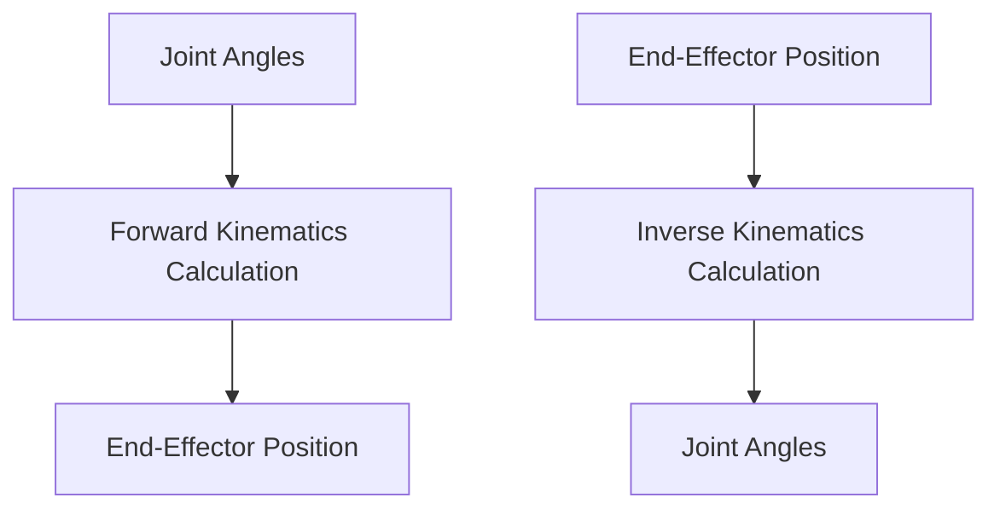

# Week 11: Humanoid Basics

## Learning Objectives

By the end of this week, you will be able to:

- Understand the fundamental kinematics and dynamics of humanoid robots.
- Differentiate between forward and inverse kinematics.
- Explore basic humanoid locomotion principles.
- Familiarize yourself with common humanoid robot platforms.

## Core Concepts

### Humanoid Robot Kinematics

Kinematics deals with the motion of robots without considering the forces that cause the motion.

-   **Forward Kinematics (FK)**: Given the joint angles, calculate the position and orientation of the end-effector (e.g., hand, foot).
-   **Inverse Kinematics (IK)**: Given the desired position and orientation of the end-effector, calculate the required joint angles.
-   **Degrees of Freedom (DoF)**: The number of independent parameters that define the configuration of a robot.

### Humanoid Robot Dynamics

Dynamics involves the study of motion considering the forces and torques acting on the robot.

-   **Mass and Inertia**: Key properties affecting how a robot moves and responds to forces.
-   **Gravity Compensation**: Actuating joints to counteract gravity's effect.
-   **Zero Moment Point (ZMP)**: A concept used in bipedal locomotion to maintain balance.

### Basic Locomotion

Humanoid locomotion is complex due to the bipedal nature. Basic methods include:

-   **Static Walking**: Moving slowly, ensuring the ZMP remains within the support polygon at all times.
-   **Dynamic Walking**: More natural walking, involving controlled falling and momentum transfer.
-   **Gait Generation**: Algorithms to produce stable and efficient walking patterns.

### Humanoid Platforms

-   **Boston Dynamics Atlas**: Famous for dynamic and agile movements.
-   **Digit (Agility Robotics)**: Bipedal robot designed for logistics.
-   **NAO (SoftBank Robotics)**: Small, programmable humanoid for research and education.

## Hands-On Lab

### Lab 11.1: Forward Kinematics for a Simple Humanoid Arm

**Objective**: Implement forward kinematics for a 2-DOF robotic arm to understand how joint angles map to end-effector positions.

**Prerequisites**:

-   Python installed.
-   Basic understanding of trigonometry.

**Steps**:

1.  **Define a 2-DOF arm**: Assume an arm with two links of lengths `L1` and `L2` and two revolute joints `theta1` and `theta2`.

    ```mermaid
    graph TD
        O[Origin (0,0)] -- L1 (theta1) --> J1[Joint 1]
        J1 -- L2 (theta2) --> E[End Effector]
    ```

2.  **Write a Python function for FK**:

    ```python
    import math

def forward_kinematics_2d_arm(L1, L2, theta1_deg, theta2_deg):
    theta1_rad = math.radians(theta1_deg)
    theta2_rad = math.radians(theta2_deg)

    # Position of Joint 1
    x1 = L1 * math.cos(theta1_rad)
    y1 = L1 * math.sin(theta1_rad)

    # Position of End Effector relative to Joint 1
    # The angle for the second link is relative to the first link
    x_ee_relative_to_j1 = L2 * math.cos(theta1_rad + theta2_rad)
    y_ee_relative_to_j1 = L2 * math.sin(theta1_rad + theta2_rad)

    # Absolute position of End Effector
    x_ee = x1 + x_ee_relative_to_j1
    y_ee = y1 + y_ee_relative_to_j1

    return (x_ee, y_ee)

# Example Usage:
```python {}
# Example Usage:
L1 = 1.0 # length of first link
L2 = 0.8 # length of second link
theta1 = 30  # degrees
theta2 = 60  # degrees

x, y = forward_kinematics_2d_arm(L1, L2, theta1, theta2)
print(f"End-effector position: ({x:.2f}, {y:.2f})")

# Try another configuration
x, y = forward_kinematics_2d_arm(L1, L2, 90, 0)
print(f"End-effector position (theta1=90, theta2=0): ({x:.2f}, {y:.2f})")
```

3.  **Experiment with different joint angles** and observe the resulting end-effector positions.

### Expected Output

For `L1=1.0`, `L2=0.8`, `theta1=30`, `theta2=60`:
```
End-effector position: (0.31, 1.76)
```
For `L1=1.0`, `L2=0.8`, `theta1=90`, `theta2=0`:
```
End-effector position (theta1=90, theta2=0): (0.00, 1.80)
```

## Checkpoint Quiz

<details>
<summary>Question 1: What is the difference between forward and inverse kinematics?</summary>

Forward kinematics calculates the end-effector position and orientation given the joint angles. Inverse kinematics calculates the required joint angles to achieve a desired end-effector position and orientation.

</details>

<details>
<summary>Question 2: Briefly explain the Zero Moment Point (ZMP) concept in humanoid locomotion.</summary>

The Zero Moment Point (ZMP) is a fundamental concept in bipedal locomotion that represents the point on the ground where the net moment of all forces (including gravity and inertial forces) acting on the robot is zero. For stable locomotion, the ZMP must remain within the robot's support polygon (the area defined by the contact points with the ground).

</details>

## References & Further Reading

- Robot Kinematics: [https://www.robot-kinematics.com/](https://www.robot-kinematics.com/)
- Humanoid Robotics: [https://www.humanoid.fandom.com/wiki/Humanoid_robotics](https://www.humanoid.fandom.com/wiki/Humanoid_robotics)
- Zero Moment Point: [https://en.wikipedia.org/wiki/Zero_moment_point](https://en.wikipedia.org/wiki/Zero_moment_point)

## Diagrams


