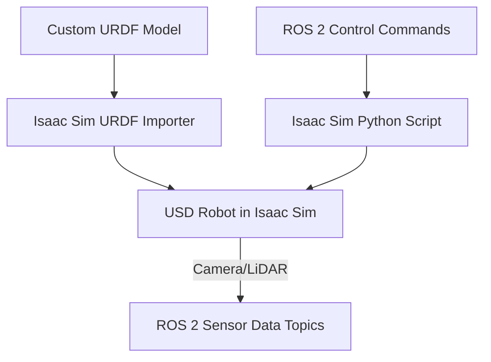

# Week 10: Advanced Isaac

## Learning Objectives

By the end of this week, you will be able to:

- Understand Isaac Sim's extension architecture for customization.
- Create custom assets (URDF/USD) for use in Isaac Sim.
- Implement advanced sensor configurations and data streaming.
- Explore the use of Python scripting for scene manipulation and control.

## Core Concepts

### Isaac Sim Extensions

Isaac Sim is built on a modular extension framework. Extensions are Python modules that add functionality to the simulator, allowing users to customize:

-   **UI elements**: Add new panels, buttons, and tools.
-   **Robot controllers**: Implement custom control algorithms.
-   **Sensor plugins**: Create specialized sensor models.
-   **Simulation components**: Extend physics or rendering capabilities.

### Custom Asset Building (URDF/USD)

While Isaac Sim supports importing various formats, USD is its native format. You can:

-   **Convert URDF to USD**: Use tools within Isaac Sim or external scripts.
-   **Create USD from scratch**: Define links, joints, materials, and physics properties directly in USD.
-   **Modular Assets**: Design reusable USD components for complex robot systems.

### Advanced Sensor Configurations

Isaac Sim provides robust sensor simulation capabilities. Advanced configurations include:

-   **Multiple Cameras**: Simulate stereo vision, multi-camera setups.
-   **LiDAR Customization**: Adjust scan patterns, noise models, and range.
-   **Force/Torque Sensors**: Add sensors to joints to measure interaction forces.
-   **ROS 2 Bridge**: Stream high-fidelity sensor data (images, point clouds) directly to ROS 2.

### Python Scripting for Control and Automation

Isaac Sim exposes a comprehensive Python API (OmniGraph and other modules) for:

-   **Scene Graph Manipulation**: Programmatically add, remove, and modify objects.
-   **Simulation Control**: Start, stop, pause, and reset simulations.
-   **Robot Control**: Implement inverse kinematics, path planning, and joint control.
-   **Data Logging**: Record simulation data for analysis and offline training.

## Hands-On Lab

### Lab 10.1: Custom Robot and Advanced Sensor Setup

**Objective**: Import a custom URDF robot into Isaac Sim, configure its sensors, and control it using a Python script.

**Prerequisites**:

-   Isaac Sim installed and running (from Week 8).
-   A basic URDF model of a robot (can be a simple arm or mobile robot).
-   ROS 2 environment configured (from Week 3).

**Steps**:

1.  **Prepare your Custom URDF**:
    -   Ensure your URDF is valid and includes collision and inertial properties. For a simple mobile robot, ensure it has a `base_link`, `wheel_left_link`, `wheel_right_link` and `caster_link` with appropriate joints.

2.  **Import URDF into Isaac Sim (using the `urdf_importer` extension)**:
    -   In Isaac Sim, go to `Window > Extensions`.
    -   Search for `urdf_importer` and enable it.
    -   Go to `File > Import > URDF` and select your robot's URDF file.
    -   Adjust import settings as needed (e.g., merge fixed joints).

3.  **Add a Camera Sensor**:
    -   Select a link on your robot (e.g., `base_link`).
    -   In the Property Window, add a `Camera` component (`+ Add > Physics > Sensors > Camera`).
    -   Configure camera properties (resolution, FOV, update rate).
    -   Add a `ROS Camera` component (`+ Add > ROS > ROS Camera`) to stream images as a ROS 2 topic.

4.  **Add a LiDAR Sensor (Optional)**:
    -   Similarly, add a `LiDAR` component to your robot.
    -   Configure LiDAR properties (scan range, number of beams, update rate).
    -   Add a `ROS LiDAR` component to stream point clouds as a ROS 2 topic.

5.  **Create a Python Script for Robot Control**:
    -   Go to `Window > Script Editor`.
    -   Write a Python script to control your robot's joints or wheels using ROS 2 topics.
    -   Example (for a differential drive robot): Publish `Twist` messages to Isaac Sim's ROS 2 bridge, which then controls the robot's wheels.

    ```python
    # Example: my_robot_control.py (to be run within Isaac Sim Script Editor)
    import carb
    from omni.isaac.core.articulations import Articulation
    from omni.isaac.core.utils.nucleus import get_nucleus_assets_path
    from omni.isaac.core.utils.stage import add_reference_to_stage
    from omni.isaac.core.world import World
    import rclpy
    from geometry_msgs.msg import Twist

    class MyRobotController:
        def __init__(self, robot_prim_path):
            self.robot = Articulation(prim_path=robot_prim_path)
            
            # Assuming a differential drive robot with left and right wheel joints
            self.left_wheel_joint = self.robot.get_joint_at_idx(self.robot.get_joint_index("left_wheel_joint"))
            self.right_wheel_joint = self.robot.get_joint_at_idx(self.robot.get_joint_index("right_wheel_joint"))
            
            self.wheel_radius = 0.05 # Adjust based on your robot model
            self.wheel_base = 0.20 # Adjust based on your robot model

            # ROS 2 setup
            rclpy.init()
            self.node = rclpy.create_node("isaac_robot_controller")
            self.subscription = self.node.create_subscription(
                Twist,
                'cmd_vel',
                self.twist_callback,
                10
            )
            self.linear_x = 0.0
            self.angular_z = 0.0
            self.node.get_logger().info("Isaac ROS 2 Controller started.")

        def twist_callback(self, msg):
            self.linear_x = msg.linear.x
            self.angular_z = msg.angular.z

        def update_robot(self):
            # Convert linear/angular velocity to wheel velocities
            v_left = (self.linear_x - self.angular_z * self.wheel_base / 2.0) / self.wheel_radius
            v_right = (self.linear_x + self.angular_z * self.wheel_base / 2.0) / self.wheel_radius
            
            self.left_wheel_joint.set_velocity_target(v_left)
            self.right_wheel_joint.set_velocity_target(v_right)

        def shutdown(self):
            rclpy.shutdown()
            self.node.destroy_node()

    # Example usage within Isaac Sim script (replace with your robot's USD path)
    # from omni.isaac.kit import SimulationApp
    # kit = SimulationApp({"headless": False})

    # world = World()
    # world.scene.add_default_ground_plane()

    # assets_path = get_nucleus_assets_path()
    # robot_asset_path = assets_path + "/Isaac/Robots/Clearpath/Jackal/jackal.usd"

    # # Add your imported robot model reference here
    # add_reference_to_stage(usd_path=robot_asset_path, prim_path="/World/Jackal")
    # world.reset()

    # controller = MyRobotController("/World/Jackal")
    # while kit.is_running():
    #     world.step(render=True)
    #     controller.update_robot()
    #     rclpy.spin_once(controller.node, timeout_sec=0)

    # kit.close()
    # controller.shutdown()
    ```

6.  **Run the Python script in Isaac Sim** and also run a ROS 2 teleop node (e.g., from Week 7) publishing `Twist` messages. Observe your robot moving in the simulator and camera/LiDAR data streaming as ROS 2 topics.

### Expected Output

You will successfully import a custom robot model into Isaac Sim, configure and stream sensor data via ROS 2 topics, and control the robot's movement using a Python script linked to ROS 2 commands.

## Checkpoint Quiz

<details>
<summary>Question 1: How can you extend Isaac Sim's functionality or customize its behavior?</summary>

Isaac Sim is designed with a modular extension framework, allowing users to create Python modules (extensions) to add custom UI elements, robot controllers, sensor plugins, and other simulation components.

</details>

<details>
<summary>Question 2: What is the primary benefit of Python scripting within Isaac Sim?</summary>

Python scripting provides a powerful API for programmatic control over the entire simulation. This includes scene graph manipulation (adding/modifying objects), simulation control (start/stop/reset), robot control (IK, path planning), and data logging, enabling complex automation and integration with external systems.

</details>

## References & Further Reading

- Isaac Sim Extensions: [https://docs.omniverse.nvidia.com/isaacsim/latest/reference_app_tutorials/tutorial_core_extensions.html](https://docs.omniverse.nvidia.com/isaacsim/latest/reference_app_tutorials/tutorial_core_extensions.html)
- Isaac Sim Python Scripting: [https://docs.omniverse.nvidia.com/isaacsim/latest/python_samples.html](https://docs.omniverse.nvidia.com/isaacsim/latest/python_samples.html)
- URDF Importer for Isaac Sim: [https://docs.omniverse.nvidia.com/isaacsim/latest/reference_app_tutorials/tutorial_urdf_importer.html](https://docs.omniverse.nvidia.com/isaacsim/latest/reference_app_tutorials/tutorial_urdf_importer.html)

## Diagrams


