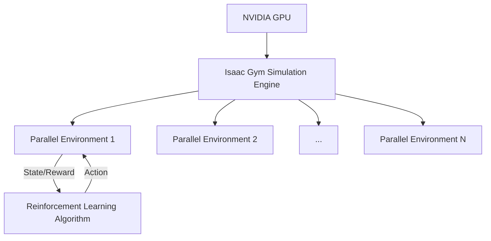

# Week 9: Isaac GYM

## Learning Objectives

By the end of this week, you will be able to:

- Understand the purpose and architecture of NVIDIA Isaac Gym.
- Set up an Isaac Gym environment for reinforcement learning.
- Load robot assets and define tasks within Isaac Gym.
- Run a basic reinforcement learning training simulation.

## Core Concepts

### NVIDIA Isaac Gym

Isaac Gym is NVIDIA's platform for high-performance GPU-accelerated robot learning. It is designed to accelerate reinforcement learning research by enabling:

-   **Massively Parallel Simulations**: Run thousands of robot environments simultaneously on a single GPU.
-   **Hardware-Accelerated Physics**: Leverage NVIDIA PhysX for real-time physics simulation on the GPU.
-   **Domain Randomization**: Efficiently randomize simulation parameters to improve transferability to the real world.
-   **Python API**: Easily define and interact with simulations using Python.

### Reinforcement Learning (RL) Overview

Reinforcement Learning is a type of machine learning where an agent learns to make decisions by interacting with an environment. The agent receives rewards or penalties for its actions, aiming to maximize cumulative reward.

-   **Agent**: The learning entity (e.g., a robot controller).
-   **Environment**: The simulated world where the agent interacts.
-   **State**: The current observation of the environment.
-   **Action**: The decision made by the agent.
-   **Reward**: Feedback from the environment based on the action.

### Isaac Gym's Role in RL

Isaac Gym provides the high-performance simulation environment crucial for RL. The ability to run many parallel environments significantly speeds up the data collection and training process for deep reinforcement learning algorithms.

## Hands-On Lab

### Lab 9.1: Basic Robot Training in Isaac Gym

**Objective**: Set up a simple Isaac Gym task, load a robot, and observe a training simulation.

**Prerequisites**:

-   NVIDIA GPU (RTX series recommended).
-   Python 3.7-3.9 (Isaac Gym has specific Python version requirements).
-   Isaac Gym installed (follow official NVIDIA instructions for download and setup).
-   Familiarity with Python.

**Steps**:

1.  **Install Isaac Gym**:
    -   Download Isaac Gym from the NVIDIA developer website.
    -   Follow the installation guide (usually involves `pip install -e .` in the `python/isaacgymenvs` directory after downloading).

2.  **Navigate to Isaac Gym Examples**:
    
    ```bash
    cd ~/isaacgym/python/isaacgymenvs
    ```
    *Note*: The exact path might vary based on your installation.

3.  **Run a simple example script** (e.g., the `franka_cabinet` example for a robotic arm opening a cabinet).
    
    ```bash
    python train.py --task FrankaCabinet --headless
    ```
    -   `--task FrankaCabinet`: Specifies the RL task to run.
    -   `--headless`: Runs the simulation without the graphical viewer (faster).

4.  **Observe the training process**:
    -   The script will initialize many parallel environments.
    -   You will see output showing training progress, episode rewards, and other RL metrics.
    -   If not in headless mode, you would see multiple robot instances being trained simultaneously.

### Expected Output

The console will show rapid iteration of training episodes, with a significant speedup compared to single-environment simulations. You'll see metrics updating, indicating that the reinforcement learning agent is interacting with many parallel instances of the Franka robot trying to open the cabinet.

## Checkpoint Quiz

<details>
<summary>Question 1: What is the primary advantage of Isaac Gym for reinforcement learning?</summary>

Isaac Gym enables massively parallel simulations on a single GPU, drastically accelerating the data collection and training process for reinforcement learning algorithms.

</details>

<details>
<summary>Question 2: Explain the concept of "domain randomization" in the context of Isaac Gym.</summary>

Domain randomization involves programmatically varying simulation parameters (e.g., physics properties, textures, lighting) across parallel environments during training. This makes the trained policies more robust and helps them generalize better when deployed in the real world, reducing the sim-to-real gap.

</details>

## References & Further Reading

- NVIDIA Isaac Gym Documentation: [https://developer.nvidia.com/isaac-gym](https://developer.nvidia.com/isaac-gym)
- Isaac Gym Examples and Tutorials: [https://github.com/NVIDIA-Omniverse/IsaacGymEnvs](https://github.com/NVIDIA-Omniverse/IsaacGymEnvs)
- Reinforcement Learning Basics: [https://www.deepmind.com/learning-resources/reinforcement-learning-for-everyone](https://www.deepmind.com/learning-resources/reinforcement-learning-for-everyone)

## Diagrams


