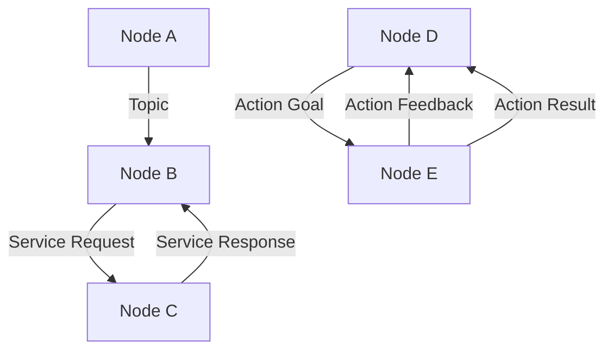

# ROS 2 Nervous System (Weeks 3–5)

## Overview

ROS 2 serves as the "nervous system" for robots, providing communication, control, and coordination.

## Learning Path

- [Week 3: ROS 2 Basics](/docs/ros2/week3)
- [Week 4: Topics, Services, and Actions](/docs/ros2/week4)
- [Week 5: Advanced ROS 2 Concepts](/docs/ros2/week5)

## Diagrams

