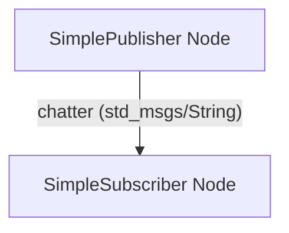

# Week 3: ROS 2 Basics

## Learning Objectives

By the end of this week, you will be able to:

- Understand ROS 2 architecture and its key concepts.
- Create and compile your first ROS 2 package.
- Write a basic ROS 2 publisher and subscriber node in Python.
- Use `ros2 run` and `ros2 topic echo` to interact with nodes.

## Core Concepts

### ROS 2 Architecture

ROS 2 (Robot Operating System 2) is a flexible framework for writing robot software. It enables modular development by providing standard services, libraries, and tools.

- **Nodes**: Executable processes that perform computation (e.g., a camera driver, a motor controller).
- **Topics**: A named bus over which nodes exchange messages. Publishers send messages, subscribers receive them.
- **Messages**: Data structures used for communication on topics.
- **Services**: A request/reply mechanism for remote procedure calls (RPCs).
- **Actions**: Long-running operations with feedback and preemption capabilities.
- **Packages**: The primary unit of ROS 2 software organization, containing nodes, libraries, configuration files, etc.
- **Workspaces**: Directories that contain multiple ROS 2 packages, allowing for simultaneous development and compilation.

### Creating a ROS 2 Package

We use `ros2 pkg create` to create a new package.

```bash
ros2 pkg create --build-type ament_python my_ros2_package
```

### Writing a Simple Publisher

A publisher node sends messages to a topic.

```python
# my_ros2_package/my_ros2_package/simple_publisher.py
import rclpy
from rclpy.node import Node
from std_msgs.msg import String

class SimplePublisher(Node):
    def __init__(self):
        super().__init__('simple_publisher')
        self.publisher_ = self.create_publisher(String, 'chatter', 10)
        self.timer = self.create_timer(0.5, self.timer_callback)
        self.i = 0

    def timer_callback(self):
        msg = String()
        msg.data = f'Hello ROS 2: {self.i}'
        self.publisher_.publish(msg)
        self.get_logger().info(f'Publishing: "{msg.data}"')
        self.i += 1

def main(args=None):
    rclpy.init(args=args)
    simple_publisher = SimplePublisher()
    rclpy.spin(simple_publisher)
    simple_publisher.destroy_node()
    rclpy.shutdown()

if __name__ == '__main__':
    main()
```

### Writing a Simple Subscriber

A subscriber node receives messages from a topic.

```python
# my_ros2_package/my_ros2_package/simple_subscriber.py
import rclpy
from rclpy.node import Node
from std_msgs.msg import String

class SimpleSubscriber(Node):
    def __init__(self):
        super().__init__('simple_subscriber')
        self.subscription = self.create_subscription(
            String,
            'chatter',
            self.listener_callback,
            10
        )
        self.subscription  # prevent unused variable warning

    def listener_callback(self, msg):
        self.get_logger().info(f'I heard: "{msg.data}"')

def main(args=None):
    rclpy.init(args=args)
    simple_subscriber = SimpleSubscriber()
    rclpy.spin(simple_subscriber)
    simple_subscriber.destroy_node()
    rclpy.shutdown()

if __name__ == '__main__':
    main()
```

### `setup.py` and `package.xml`

Update `setup.py` to include your executables:

```python
# my_ros2_package/setup.py
from setuptools import find_packages, setup

package_name = 'my_ros2_package'

setup(
    name=package_name,
    version='0.0.0',
    packages=find_packages(exclude=['test']),
    data_files=[
        ('share/' + package_name, ['package.xml']),
        ('share/' + package_name + '/resource', ['resource/' + package_name]),
    ],
    install_requires=['setuptools'],
    zip_safe=True,
    maintainer='Your Name',
    maintainer_email='your.email@example.com',
    description='TODO: Package description',
    license='TODO: License declaration',
    tests_require=['pytest'],
    entry_points={
        'console_scripts': [
            'publisher = my_ros2_package.simple_publisher:main',
            'subscriber = my_ros2_package.simple_subscriber:main',
        ],
    },
)
```

Ensure `package.xml` has `<depend>rclpy</depend>` and `<depend>std_msgs</depend>`.

## Hands-On Lab

### Lab 3.1: Your First ROS 2 Nodes

**Objective**: Create, compile, and run a simple ROS 2 publisher and subscriber.

**Steps**:

1.  **Create a ROS 2 workspace (if you don't have one)**:
    ```bash
    mkdir -p ~/ros2_ws/src
    cd ~/ros2_ws/src
    ```
2.  **Create a new ROS 2 package**:
    ```bash
    ros2 pkg create --build-type ament_python my_ros2_package
    ```
3.  **Navigate into your new package's source directory**:
    ```bash
    cd my_ros2_package/my_ros2_package
    ```
4.  **Create `simple_publisher.py` with the code provided above.**
5.  **Create `simple_subscriber.py` with the code provided above.**
6.  **Navigate back to the package root**:
    ```bash
    cd ..
    ```
7.  **Update `setup.py`** in `my_ros2_package/setup.py` with the `entry_points` section as shown above.
8.  **Update `package.xml`**: Ensure `<depend>rclpy</depend>` and `<depend>std_msgs</depend>` are present.
9.  **Build your workspace**:
    ```bash
    cd ~/ros2_ws
    colcon build --packages-select my_ros2_package
    ```
10. **Source your workspace**:
    ```bash
    source install/setup.bash
    ```
11. **Run the publisher (in one terminal)**:
    ```bash
    ros2 run my_ros2_package publisher
    ```
12. **Run the subscriber (in a second terminal, after sourcing)**:
    ```bash
    ros2 run my_ros2_package subscriber
    ```
13. **Verify communication**: You should see the subscriber printing "I heard: 'Hello ROS 2: X'" messages.

### Expected Output

In the publisher terminal, you will see messages like:
```
[INFO] [simple_publisher]: Publishing: "Hello ROS 2: 0"
[INFO] [simple_publisher]: Publishing: "Hello ROS 2: 1"
...
```
In the subscriber terminal, you will see messages like:
```
[INFO] [simple_subscriber]: I heard: "Hello ROS 2: 0"
[INFO] [simple_subscriber]: I heard: "Hello ROS 2: 1"
...
```

## Checkpoint Quiz

<details>
<summary>Question 1: What is the primary purpose of a ROS 2 node?</summary>

A ROS 2 node is an executable process that performs computation, such as controlling hardware or processing data.

</details>

<details>
<summary>Question 2: How do ROS 2 nodes typically communicate with each other?</summary>

ROS 2 nodes primarily communicate using topics (for publish/subscribe), services (for request/reply), and actions (for long-running, goal-oriented tasks).

</details>

## References & Further Reading

- ROS 2 Foxy Documentation: [https://docs.ros.org/en/foxy/Tutorials.html](https://docs.ros.org/en/foxy/Tutorials.html)
- ROS 2 Python Development: [https://docs.ros.org/en/foxy/Tutorials/Beginner-CLI-Tools/Writing-A-Simple-Publisher-And-Subscriber-Python.html](https://docs.ros.org/en/foxy/Tutorials/Beginner-CLI-Tools/Writing-A-Simple-Publisher-And-Subscriber-Python.html)

## Diagrams



