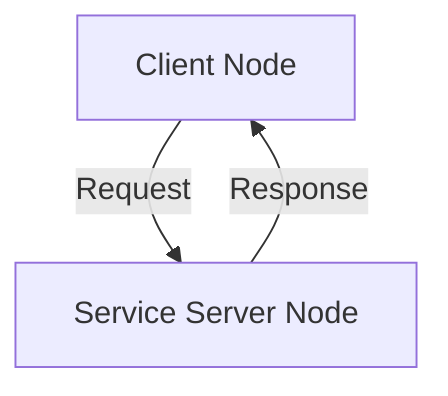
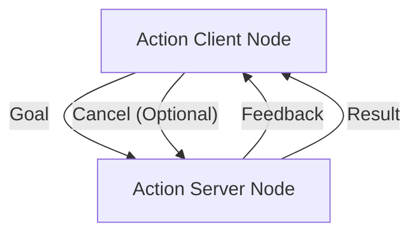
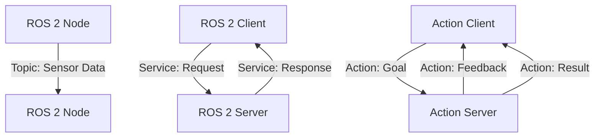

# Week 4: Topics, Services, and Actions

## Learning Objectives

By the end of this week, you will be able to:

- Differentiate between ROS 2 topics, services, and actions.
- Implement ROS 2 services for request-response communication.
- Implement ROS 2 actions for goal-oriented, long-running tasks with feedback.
- Understand when to use each communication mechanism.

## Core Concepts

### Topics (Recap)

Topics are for continuous, asynchronous data streams (e.g., sensor data, motor commands).

- **Publishers**: Send messages.
- **Subscribers**: Receive messages.
- **One-to-many communication**: Multiple subscribers can listen to one publisher.

### Services

Services are for synchronous request/reply communication. A client sends a request, and a server processes it and sends back a response.

- **Client**: Initiates the request.
- **Server**: Receives the request, performs work, and sends a response.
- **Blocking**: The client typically waits for the response.



### Actions

Actions are designed for long-running, goal-oriented tasks (e.g., navigating to a goal, picking up an object). They provide:

- **Goal**: The objective to achieve.
- **Feedback**: Updates on the progress of the action.
- **Result**: The final outcome of the action.
- **Preemption**: The ability to cancel an ongoing action.



### When to Use Which?

- **Topics**: For continuous, unidirectional data flow (e.g., odometry, camera frames).
- **Services**: For immediate, blocking request/reply interactions (e.g., toggling a light, getting a sensor reading once).
- **Actions**: For long-running tasks that require progress feedback and can be cancelled (e.g., moving a robot arm, executing a navigation plan).

## Hands-On Lab

### Lab 4.1: Implementing a Simple ROS 2 Service

**Objective**: Create a ROS 2 service that adds two integers.

**Steps**:

1.  **Define a new service message (`AddTwoInts.srv`)**: In your `my_ros2_package` (from Week 3), create a `srv` directory and `AddTwoInts.srv` inside it.

    ```
    # srv/AddTwoInts.srv
    int64 a
    int64 b
    ---
    int64 sum
    ```

2.  **Update `package.xml`**:

    ```xml
    <!-- my_ros2_package/package.xml -->
    <build_depend>rosidl_default_generators</build_depend>
    <exec_depend>rosidl_default_runtime</exec_depend>
    <member_of_group>rosidl_interface_packages</member_of_group>
    ```

3.  **Update `CMakeLists.txt`** (in `my_ros2_package/CMakeLists.txt`) to build the service:

    ```cmake
    # ...
    find_package(rosidl_default_generators REQUIRED)
    rosidl_generate_interfaces(${PROJECT_NAME}
      "srv/AddTwoInts.srv"
    )
    # ...
    ament_python_install_package()
    ```

4.  **Create service server node (`add_two_ints_server.py`)**:

    ```python
    # my_ros2_package/my_ros2_package/add_two_ints_server.py
    import rclpy
    from rclpy.node import Node
    from my_ros2_package.srv import AddTwoInts

    class AddTwoIntsService(Node):
        def __init__(self):
            super().__init__('add_two_ints_server')
            self.srv = self.create_service(AddTwoInts, 'add_two_ints', self.add_two_ints_callback)
            self.get_logger().info('AddTwoInts service is ready.')

        def add_two_ints_callback(self, request, response):
            response.sum = request.a + request.b
            self.get_logger().info(f'Incoming request: a={request.a}, b={request.b}. Sending response: sum={response.sum}')
            return response

    def main(args=None):
        rclpy.init(args=args)
        add_two_ints_service = AddTwoIntsService()
        rclpy.spin(add_two_ints_service)
        add_two_ints_service.destroy_node()
        rclpy.shutdown()

    if __name__ == '__main__':
        main()
    ```

5.  **Create service client node (`add_two_ints_client.py`)**:

    ```python
    # my_ros2_package/my_ros2_package/add_two_ints_client.py
    import sys
    import rclpy
    from rclpy.node import Node
    from my_ros2_package.srv import AddTwoInts

    class AddTwoIntsClient(Node):
        def __init__(self):
            super().__init__('add_two_ints_client')
            self.cli = self.create_client(AddTwoInts, 'add_two_ints')
            while not self.cli.wait_for_service(timeout_sec=1.0):
                self.get_logger().info('service not available, waiting again...')
            self.req = AddTwoInts.Request()

        def send_request(self, a, b):
            self.req.a = a
            self.req.b = b
            self.future = self.cli.call_async(self.req)
            rclpy.spin_until_future_complete(self, self.future)
            return self.future.result()

    def main(args=None):
        rclpy.init(args=args)

        if len(sys.argv) != 3:
            print('Usage: ros2 run my_ros2_package client A B')
            return

        add_two_ints_client = AddTwoIntsClient()
        response = add_two_ints_client.send_request(int(sys.argv[1]), int(sys.argv[2]))
        add_two_ints_client.get_logger().info(
            f'Result of add_two_ints: for {sys.argv[1]} + {sys.argv[2]} = {response.sum}'
        )
        add_two_ints_client.destroy_node()
        rclpy.shutdown()

    if __name__ == '__main__':
        main()
    ```

6.  **Update `setup.py`** in `my_ros2_package/setup.py`:

    ```python
    # ...
    entry_points={
        'console_scripts': [
            'publisher = my_ros2_package.simple_publisher:main',
            'subscriber = my_ros2_package.simple_subscriber:main',
            'server = my_ros2_package.add_two_ints_server:main',
            'client = my_ros2_package.add_two_ints_client:main',
        ],
    },
    # ...
    ```

7.  **Build and source your workspace** (from `~/ros2_ws`):

    ```bash
    colcon build --packages-select my_ros2_package
    source install/setup.bash
    ```

8.  **Run the service server (in one terminal)**:

    ```bash
    ros2 run my_ros2_package server
    ```

9.  **Run the service client (in a second terminal, after sourcing)**:

    ```bash
    ros2 run my_ros2_package client 5 3
    ```

### Expected Output

Server terminal:
```
[INFO] [add_two_ints_server]: AddTwoInts service is ready.
[INFO] [add_two_ints_server]: Incoming request: a=5, b=3. Sending response: sum=8
```
Client terminal:
```
[INFO] [add_two_ints_client]: Result of add_two_ints: for 5 + 3 = 8
```

## Checkpoint Quiz

<details>
<summary>Question 1: What is the main difference in communication pattern between ROS 2 topics and services?</summary>

Topics implement a publish/subscribe pattern for asynchronous, one-to-many data streaming. Services implement a request/reply pattern for synchronous, one-to-one communication where the client waits for a response from the server.

</details>

<details>
<summary>Question 2: When would you use a ROS 2 action instead of a service?</summary>

Actions are used for long-running tasks that require periodic feedback on their progress and the ability to be preempted (cancelled) before completion, whereas services are for immediate, blocking operations.

</details>

## References & Further Reading

- ROS 2 Services Tutorial: [https://docs.ros.org/en/foxy/Tutorials/Beginner-CLI-Tools/Writing-A-Simple-Service-And-Client-Python.html](https://docs.ros.org/en/foxy/Tutorials/Beginner-CLI-Tools/Writing-A-Simple-Service-And-Client-Python.html)
- ROS 2 Actions Tutorial: [https://docs.ros.org/en/foxy/Tutorials/Beginner-CLI-Tools/Understanding-ROS2-Actions/Understanding-ROS2-Actions.html](https://docs.ros.org/en/foxy/Tutorials/Beginner-CLI-Tools/Understanding-ROS2-Actions/Understanding-ROS2-Actions.html)

## Diagrams


