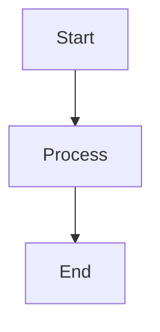

import Tabs from '@theme/Tabs';
import TabItem from '@theme/TabItem';

## Learning Objectives

By the end of this chapter, you will be able to:

- Objective 1
- Objective 2
- Objective 3

## Core Concepts

### Concept 1

Explanation of the first core concept.

### Concept 2

Explanation of the second core concept.

## Hands-On Lab

### Lab Setup

Instructions for setting up the lab environment.

### Lab Exercise

Step-by-step lab instructions:

1. Step one
2. Step two
3. Step three

### Expected Output

What students should see or achieve.

## Checkpoint Quiz

Question 1: What is...?

Answer and explanation.

Question 2: How does...?

Answer and explanation.

## Safety & Ethics Notes

:::info Safety Reminder
Important safety considerations for this chapter.
:::

:::warning Ethics Consideration
Ethical considerations related to the content.
:::

## References & Further Reading

- Reference 1: [Title](https://example.com)
- Reference 2: [Title](https://example.com)
- Reference 3: [Title](https://example.com)

## Diagrams

